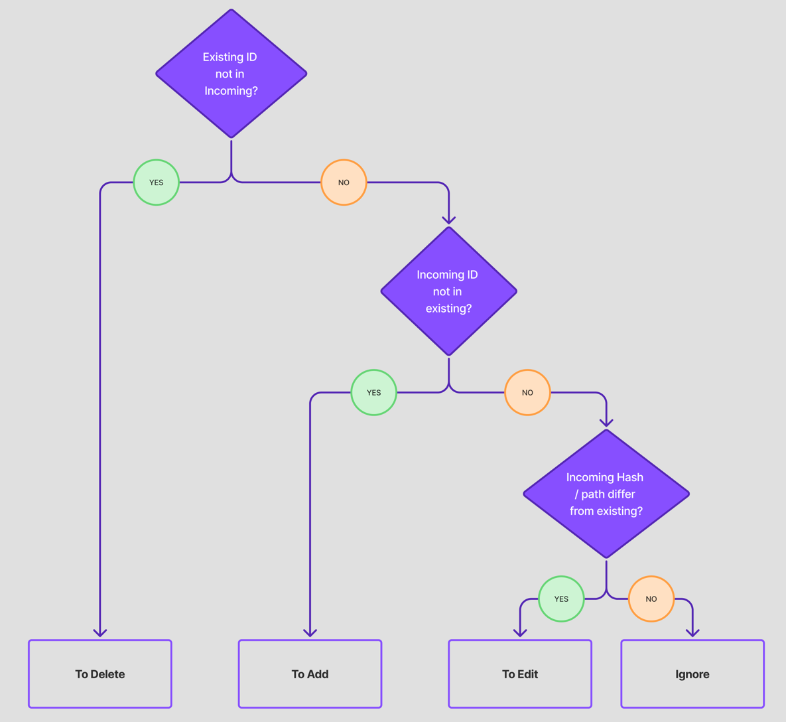

<h1 align="center">The Project Service</h1>

## Overview

The Project Service manages user projects and their files.  
It retrieves, creates, updates, and deletes projects, computes diffs during autosave, and delegates file
content storage to the GCS Service. It exposes an editable view of a user’s project structure and
provides the data needed by the AI service for code-related chat.

---

## Responsibilities

- Retrieve user projects and their files as structured snapshots
- Create, rename, and delete projects
- Apply autosave updates using diff-based persistence
- Manage file metadata and versioning state
- Store and fetch file content via the GCS Service

---

## Boundaries & Non-Responsibilities

The Project Service does **not**:

- store file contents directly (delegated to the GCS Service)
- execute or evaluate user code
- provide AI responses
- expose project files publicly without authorization

It only manages project metadata, file paths, and autosave changes.

---

## Data Models

### Entities
```
ProjectFile
    id: UUID
    projectId: UUID
    contentUrl: String                // GCS path
    contentHash: String               // sha256(content)
    filePath: String
    fileLanguage: LanguageType

UserProject
    id: UUID
    name: String
    userId: UUID
    requestHash: UUID                 // deduplicates form submissions
    projectLanguage: LanguageType
    projectVisibility: Visibility
    createdAt: OffsetDateTime?
    updatedAt: OffsetDateTime?
```

### Request DTOs
```
ProjectSnapshot
    projectId: UUID
    projectName: String
    projectLanguage: LanguageType
    files: List<ProjectFileSnapshot>

ProjectFileSnapshot
    id: UUID?
    path: String
    language: LanguageType
    content: String

CreateProjectRequest
    projectName: String
    projectLanguage: LanguageType
    requestHash: UUID
```

### Response DTOs
```
ProjectListResponse
    projects: List<ProjectSnapshot>

ProjectSnapshotDiff
    toAdd: List<ProjectFileSnapshot>
    toDeleteFiles: List<ProjectFile>
    toUpdate: List<ProjectFileSnapshot>
```

Snapshots represent the complete client-side state for a project.  
Diffs isolate only what has changed, minimizing writes and network usage.

---

## Core Operations

- Fetch a user's projects and return them as snapshots
- Persist autosave snapshots after computing diffs
- Modify project metadata (create, rename, delete)
- Retrieve and update file content via the GCS service

---

## Workflows

### Projects Fetch Workflow
```
Client requests projects
→ Project Service fetches user's project IDs
→ For each ID, fetch file metadata
→ Retrieve file contents from GCS
→ Assemble and return ProjectSnapshot list
```

### Diff Computation Workflow

Diffing is performed by `ProjectSnapshotDiffer`:

```
incoming snapshot vs existing DB files
→ missing IDs → delete
→ new snapshots (id == null) → add
→ existing IDs where hash differs → update
```

Only changed files are persisted or transmitted.  
The diagram below illustrates the branching logic:



---

## Public API

| Method | Path                     | Returns               | Purpose                                      |
|------: |--------------------------|-----------------------|----------------------------------------------|
|   GET  | `/projects/{pid}/get`    | `ProjectSnapshot`     | Retrieve the snapshot for one project        |
|   GET  | `/projects/my`           | `ProjectListResponse` | Retrieve the user's project list             |
|  POST  | `/projects/save`         | `ProjectSnapshot`     | Autosave project and return updated snapshot |
|  POST  | `/projects/create`       | `ProjectListResponse` | Create a new project                          |
|  POST  | `/projects/rename`       | `ProjectListResponse` | Rename an existing project                    |
|  POST  | `/projects/{pid}/delete` | `ProjectListResponse` | Delete a project and refresh project list     |

All endpoints accept fully-formed snapshots and return authoritative state.

---

## Integration Points

**Inbound dependencies**
- GCS Service: read/write file contents
- AI Service: consumes file content for contextual prompting

**Outbound**
- None; the Project Service does not push changes elsewhere.

---

## Future Work / Known Gaps

- Incremental diffing for large file trees
- Support for branching or project version history
- Multi-file execution and environment provisioning
- Per-language formatting and linting hooks