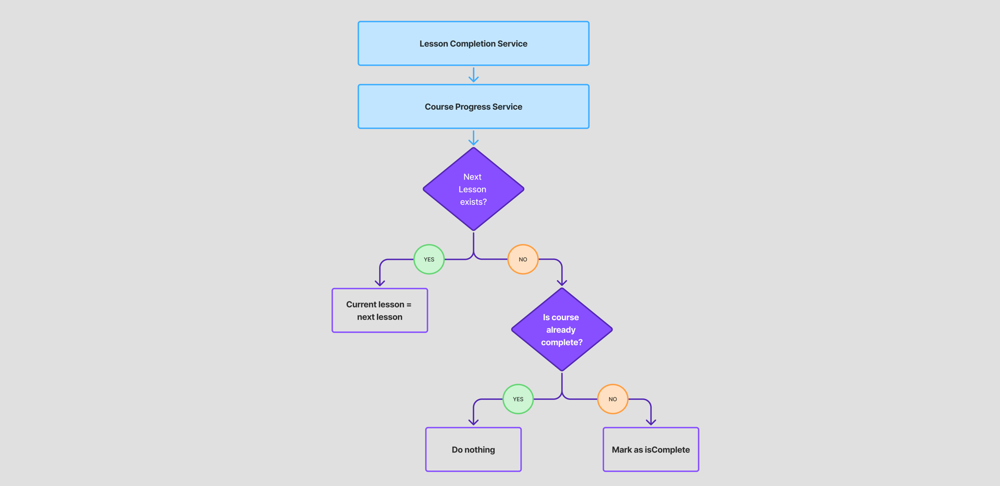

<h1 align="center">The Course Progress Service</h1>

## Overview

The Course Progress Service maintains a user’s current position in a course.  
It stores the active lesson, tracks enrollment, and marks courses complete when the final lesson is
finished. It translates lesson outcomes into persistent navigation state so the frontend always knows
*where the user should go next*.

---

## Responsibilities

- Initialize progress when a user starts a course
- Persist the current lesson for each enrolled course
- Advance the user to the next lesson after completion
- Mark a course as completed when no next lesson exists
- Provide enrolled course IDs for routing and dashboards
- Reset all progress for a course when requested

---

## Boundaries & Non-Responsibilities

The Course Progress Service does **not**:

- evaluate correctness or award points  
  ([Lesson Completion Service](lesson-completion-service.md) handles that)

- return catalog content or lesson structure  
  ([Catalog Service](../catalog/catalog-service-docs.md) owns the tree: modules → lessons → exercises)

It focuses exclusively on tracking and updating the user's current progress in a course, namely the current lesson and whether it has been completed. 

---

## Data Models

### Persisted Entity
```
CourseProgress
    id: (userId, courseId)        // composite PK
    currentLessonId: UUID         // active lesson
    createdAt: OffsetDateTime
    updatedAt: OffsetDateTime
    isComplete: Boolean           // true once last lesson finished
```

### Embedded Key
```
CourseProgressId
    userId: UUID
    courseId: UUID
```

### Response DTOs
```
CourseProgressResponse
    courseId: UUID
    currentLessonId: UUID
    isComplete: Boolean
    moduleTitle: String        // denormalized for UI
    courseTitle: String

CourseProgressResponseWithEnrolled
    current: CourseProgressResponse
    enrolled: List<UUID>

CourseProgressWithCompletion
    courseProgressResponse: CourseProgressResponse
    isFirstCompletion: Boolean
```

---

## Core Operations

- `findOrCreate(userId, courseId)`
  Ensures a progress row exists and sets `currentLessonId` to the course’s first lesson.

- `updateLesson(userId, courseId, isCompleted, newLessonId, currentLessonId)`
    - Updates lesson pointer when the current lesson is finished
    - Marks the course complete if there is no next lesson
    - Returns whether this was the user's first ever course completion

- `resetUserCourseProgress(userId, courseId)`
  Deletes lesson completions and restarts progress at lesson one.

- `findCurrentCourseId(userId)`
  Drives top-level routing to determine which course UI to show by default.

---

## Public API

| Method | Path                                | Returns                        | Purpose                                                          |
|-------:|-------------------------------------|--------------------------------|------------------------------------------------------------------|
|    GET | `/progress/course/current`          | `UUID?`                        | Get the user's current active course                             |
|    GET | `/progress/course/enrolled`         | `List<UUID>`                   | Get all courseIds the user is enrolled in                        |
|    GET | `/progress/course/ids`              | `List<CourseProgressResponse>` | Retrieve progress objects for specified courseIds                |
|   POST | `/progress/course/change`           | `CourseProgressWithEnrolled`   | Switch active course and return it with updated enrolled courses |
|   POST | `/progress/course/{courseId}/reset` | `CourseProgressResponse`       | Reset the user's progress for a course                           |

---

## How Progress Advances

```
Lesson Completion →
    updateLesson(...)
        if nextLessonId != null:
            currentLessonId = nextLessonId
        else:
            isComplete = true
```

The `isFirstCompletion` flag signals that the UI should display a *course completion* screen.

Below is a decision flow diagram to illustrate:


---

## Integration Points

**Inbound**
- Lesson Completion Service → calls `updateLesson` after a lesson is finished

**Outbound**
- Catalog Service → supplies first lesson ID and next lesson lookup

Progress logic does not depend on coins, streaks, or analytics.

---

## Future Work / Known Gaps

- Progress milestones or achievement triggers