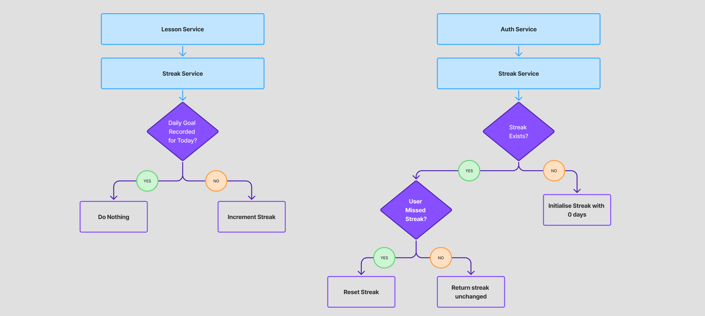

<h1 align="center">The Streak Service</h1>

## Table of Contents

1. [Overview](#overview)
2. [Responsibilities](#responsibilities)
3. [Boundaries & Non-Responsibilities](#boundaries--non-responsibilities)
4. [Data Models](#data-models)
   - [Entities](#entities)
   - [Response Models](#response-models)
5. [Core Operations](#core-operations)
6. [Login Refresh Behavior](#login-refresh-behavior)
7. [Streak Logic](#streak-logic)
8. [Public API](#public-api)
9. [Workflows](#workflows)
   - [Lesson Completion → Increment](#lesson-completion--increment)
   - [Login → Refresh](#login--refresh)
10. [Integration Points](#integration-points)
11. [Future Work / Known Gaps](#future-work--known-gaps)

## Overview

The Streak Service tracks whether a user has met their daily learning goal, maintains their current and best streak values, and applies reset logic when a day is missed.  
It daily completions of lessons into streak state and exposes streak information to other services, such as lesson completion.

The service is timezone-aware—streaks are measured according to the user’s local day, not UTC.  
It is also invoked during authentication: the Auth Service triggers streak initialization and optionally performs a same-day streak refresh when a user logs in.

---

## Responsibilities

- Initialize streak records for newly created users
- Refresh streak state on login (e.g., reset if yesterday was missed)
- Increment streaks when users submit a qualifying lesson
- Reset streaks when a day has been missed
- Track the user’s **current**, **best**, and **last goal-met** timestamps
- Provide weekly summaries for UI streak calendars

---

## Boundaries & Non-Responsibilities

The Streak Service does **not**:

- issue coins or XP
- evaluate answers or lesson correctness

It only reacts to external signals, namely login and lesson completion, and updates streak state accordingly.

---

## Data Models

### Entities
```
UserStreak
    userId: UUID                // primary key
    currentStreakDays: Int
    bestStreakDays: Int
    lastMetLocalDate: LocalDate?
    lastMetGoalUtc: OffsetDateTime?

UserDailyGoal
    userDailyGoalId.localDate: LocalDate
    userId: UUID
```

### Response Models
```
UserStreakResponse
    current: Int
    best: Int
    lastMet: LocalDate?

DailyGoalResponse
    date: LocalDate
    met: Boolean

StreakResponsePacket
    action: StreakAction      // NONE | INCREMENT
    response: UserStreakResponse
```

---

## Core Operations

- `getStreak(userId)`  
  Initializes streak if missing and applies reset rules on login.  
  This is why calling it from `buildLoginResponse` automatically “refreshes” stale streaks.

- `recordGoalMet(userId, nowUtc)`  
  Marks today's activity, increments streak if appropriate, persists values, and returns updated streak.

- `getPastWeekMondayToSunday(userId)`  
  Produces the UI-ready streak calendar for the past 7 days.

---

## Login Refresh Behavior

During login, the Auth Service executes:

```
val streak = userStreakPortForAuth.getStreak(user.id)
```

This call has side effects:

- If the user has **never** done a lesson → create initial streak row
- If the user missed yesterday → **reset** the streak here
- If today already has an entry → leave streak unchanged

This ensures streaks are always correct **before** the client renders the dashboard.

---

## Streak Logic

```
lastMet == null        → streak = 1
today == lastMet + 1   → streak += 1
today > lastMet + 1    → streak reset to 1
today == lastMet       → no change
```

All comparisons use the user's timezone, not UTC.

The below diagram shows the decision flow of the streak logic:


---

## Public API

| Method | Path                        | Returns                  | Purpose                                            |
|------: |-----------------------------|--------------------------|----------------------------------------------------|
|   GET  | `/progress/streak/get`      | `UserStreakResponse`     | Initialize/refresh streak and return state         |
|   GET  | `/progress/streak/week`     | `List<DailyGoalResponse>`| Weekly streak calendar for UI components           |

---

## Workflows

### Lesson Completion → Increment
```
Lesson Completion Service → recordGoalMet
Resolve timezone
Create one daily record if none exists
Increment streak if consecutive
Persist updates
Return StreakResponsePacket
```

### Login → Refresh
```
AuthService.buildLoginResponse
→ getStreak(userId)
→ initialize if missing
→ reset if yesterday missed
→ return up-to-date streak for dashboard
```

---

## Integration Points

**Inbound**
- Lesson Completion → `recordGoalMet`
- Auth Service → `getStreak` during login

**Outbound**
- Reads user timezone from User/Auth subsystem
- No external write dependencies

All streak persistence is local.

---

## Future Work / Known Gaps

- Streak freeze (“buy a day”) mechanics
- Time-window flexibility (e.g., 24h rolling windows)
- Streak milestones triggering achievements
- Timezone migration handling
